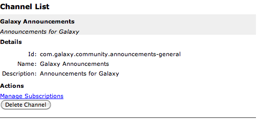

******************
Channel Setup
******************

Remember, in Constellation, channels are synonymous with forums.

Creating Channels
==================
From your application's available actions, choose Manage Channels to begin the channel management/creation process.

.. image:: _static/channel_setup_1.png

Click the "+" from the channel actions menu to begin the process of creating a new channel/forum

.. image:: _static/channel_setup_1a.png

Similar to the create application action, this will reveal the create channel form.

.. image:: _static/channel_setup_2.png

- For choose a channel id, e.g., *announcements* or *constellation-announcements*
.. note:: Channel Id's must be domain name compliant, wildcards: *,  are not allowed. The application id will be automatically prefixed to the channel id so there is no need to include it.

- Provide a name for this channel.  This name that will be available to users of this forum, e.g., *Galaxy Announcements*
- As with the channel name, provide a channel description.  Again, this will be available to users of this forum,
  e.g., *The place to go for announcements about Galaxy*
- Finally, you can set default subscriber permissions on this channel.  The default permissions will reflect the default 
  permissions you set when you created the application.  If you would like this channel to require different permissions, you can
  set that accordingly at this time.
- Once your are satisfied with your channel, click the *Add Channel* button.

.. warning:: At this time, once a channel is created it cannot be modified.  If you have a typo in your channel name, or description, you will need to delete your channel, which includes all of it's data if any, and create a new channel.

Channel Management
===================
Once a channel is created, you can view it's details on the channel management screen.

